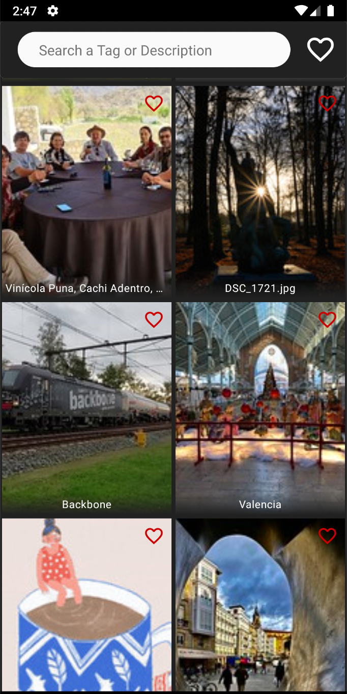
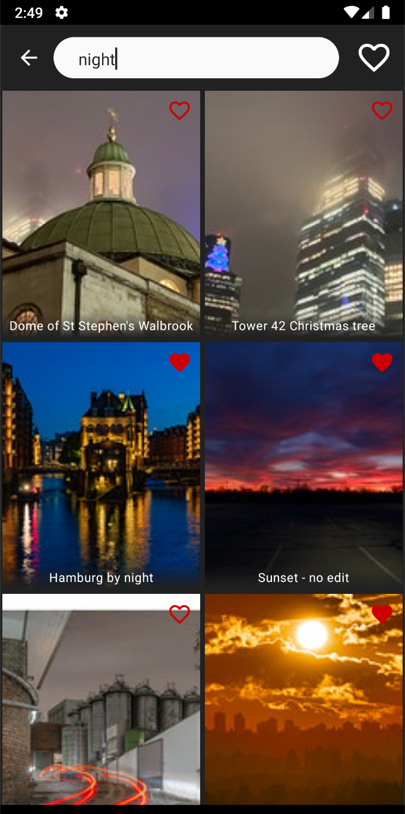

# ImageBrowser
An image brower supporting
 - pagination for infinite scroll
 - bookmarks
 - photo detail
 - search history
 - offline first: It caches searched photos
 - remove outdated cached data (created 7 days ago) every day 
 
 

    
    
    
    
    

 
 ## Technologies
  - Kotlin
  - Clean Arch + MVVM
  - Jetpack compose
  - coroutine + flow
  - Retrofit
  - Hilt
  - Work manager
