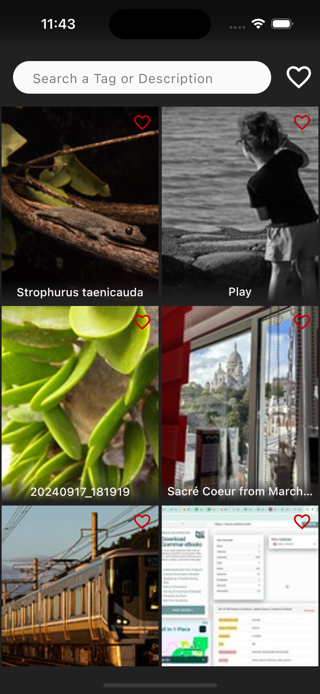
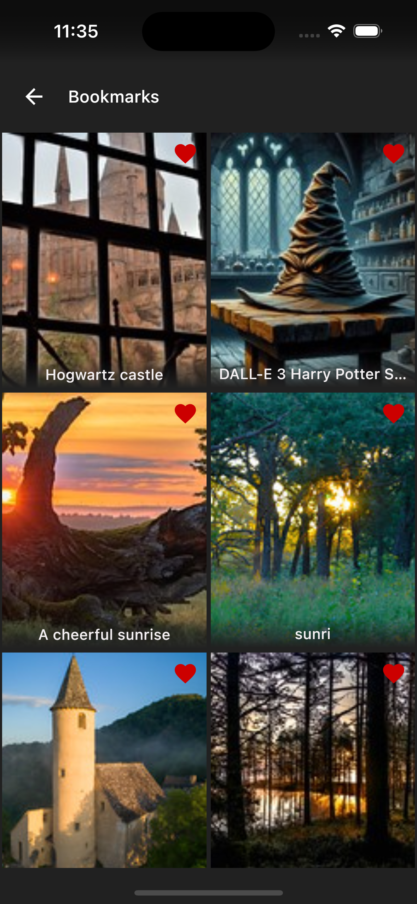
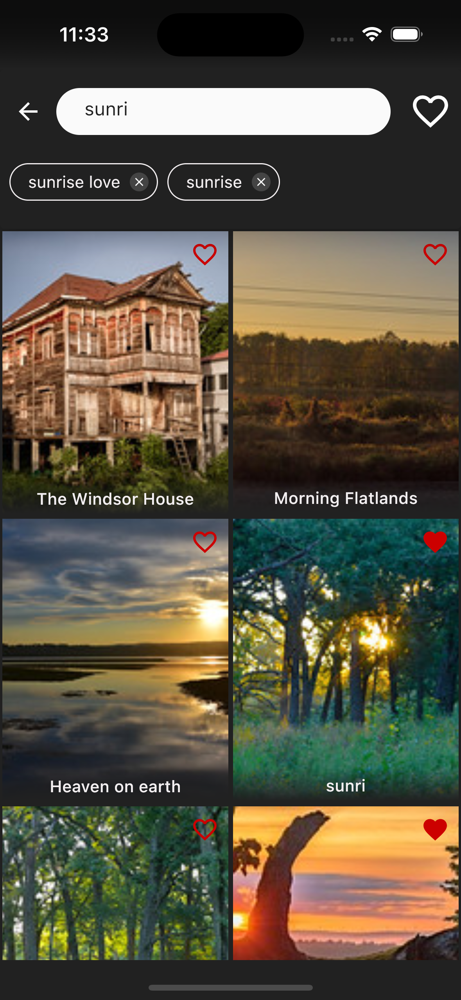
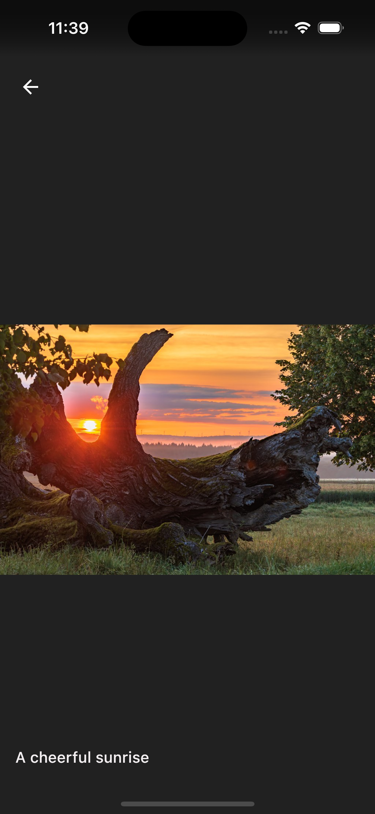

# ImageBrowser
I migrated the [android `ImageBrowser` project](https://github.com/RosaHosseini/ImageBrowser) to KMP(kotlin multiplatform). Which supports both `android` and `ios`.

An image browser supporting
 - Pagination for infinite scroll
 - Bookmarks
 - Photo detail
 - Search history
 - Recycle outdated cached data (created 7 days ago) every day 

    
    
    
    

 
 ## Technologies
  - Kotlin
  - Clean Arch + MVI
  - Jetpack compose
  - coroutine + flow
  - Ktor
  - Koin
  - Modularization
