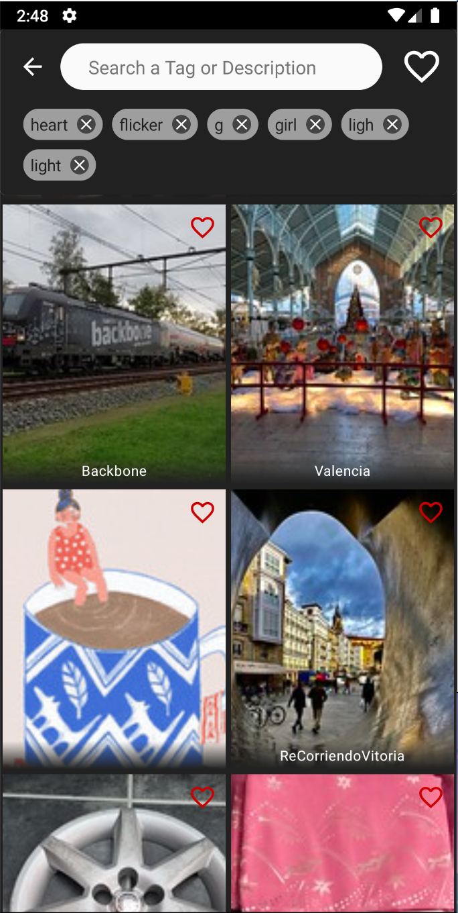
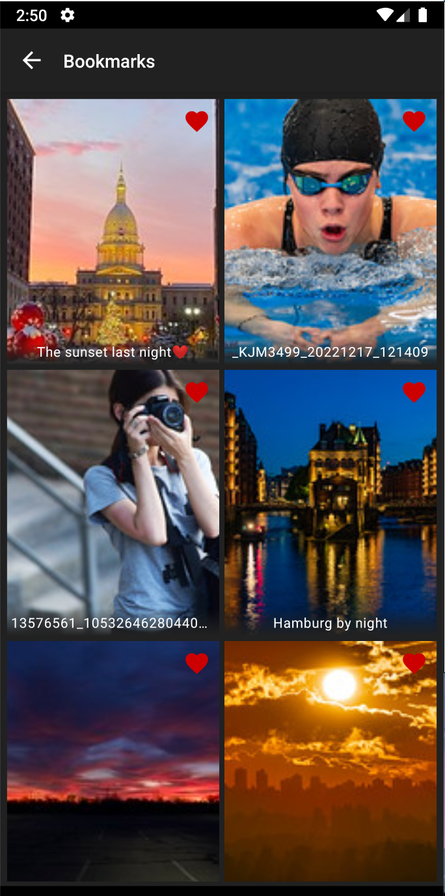
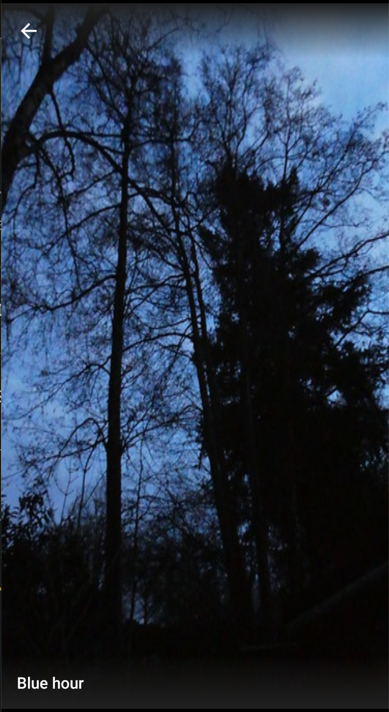

# ImageBrowser
An image browser supporting
 - Pagination for infinite scroll
 - Bookmarks
 - Photo detail
 - Search history
 - Offline first: It caches searched photos
 - Recycle outdated cached data (created 7 days ago) every day 
 
 

    
    
    
    
    

    
    
    
    

 
 ## Technologies
  - Kotlin
  - Clean Arch + MVVM
  - Jetpack compose
  - coroutine + flow
  - Retrofit
  - Hilt
  - Work manager
  - Modularization
